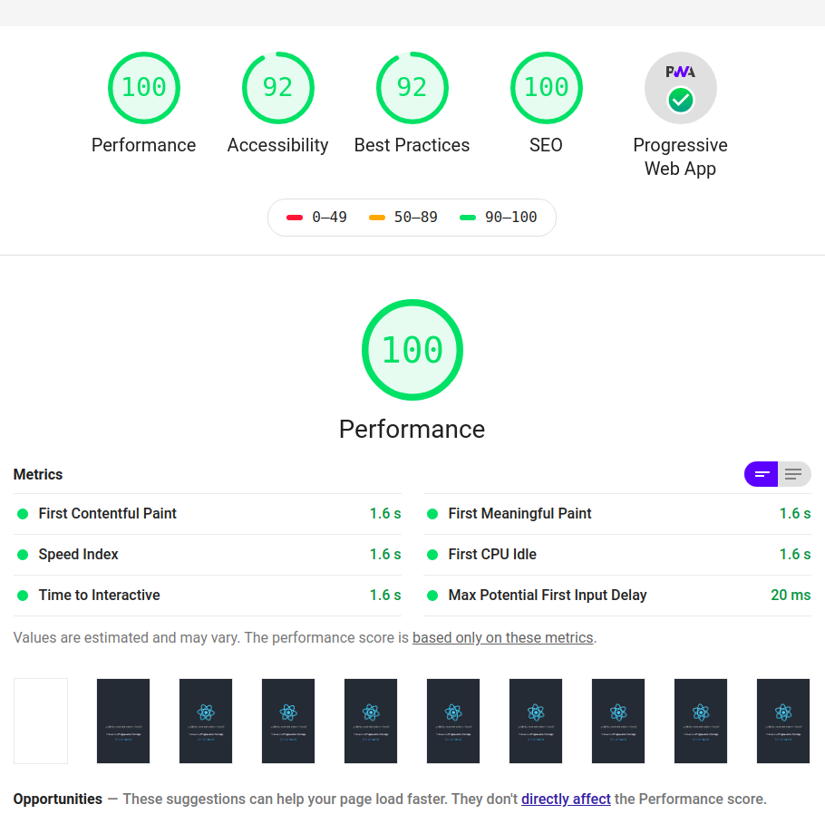

# Desarrollo de una PWA con React 
Este proyecto se realiza por diversión para probar la funcionalidad de PWA y cache con React.
Visita el sitio [aquí](https://wpa-react-68110.web.app/ 'Ir a firebase')

## La travesia de para encontrar información 
La verdad no fue díficil pero si tomó tiempo leer documentación, un par de post y videos en YT.

Pero para resumir fue muy simple.
1) Realizar el build del proyecto (`yarn run build`)
2) Esto generará un `index.html` y `service-worker.js` dentro de `build/` 
3) Copiar y pegar el siguiente código debajo de todas tus etiquetas `<scrip/>` en el archivo `index.html`
   
      ``

4) Copiar y pegar el siguiente código al final del archivo `service-worker.js`

          `const cacheUrls = [
            "/",
            "/build/static/css/*.css",
            "/build/static/css/**/*.css",
            "/build/static/js/*.js",
            "/build/static/js/**/*.js",
            "/build/media/**/*.jpg",
            "/build/media/*.jpg"
          ];`
          `const version = "v1/";
          self.addEventListener("install", event => {`
            `self.skipWaiting();
            event.waitUntil(
              caches
                .open(version)
                .then(cache => cache.addAll(cacheUrls))
                .then(() => console.log("assets cached"))
            );
          });`
          `self.addEventListener("fetch", event => {
            if (event.request.method === "GET") {
              event.respondWith(
                fetch(event.request).catch(() => {
                  return caches.match(event.request);
                })
              );
            }
          });
          `

# Screenshots

  

# NOTA
- Aun no encuentro la forma de automatizar el codigo para que se realice automaticamente, quizá es momento para tomar un curso 😃 
- Con estos cambios puedes codificar tranquilamente tu aplicación, **PERO** recuerda que debes modificar la variable `cacheUrls` dependiendo que archivos necesites ponerlos en cache